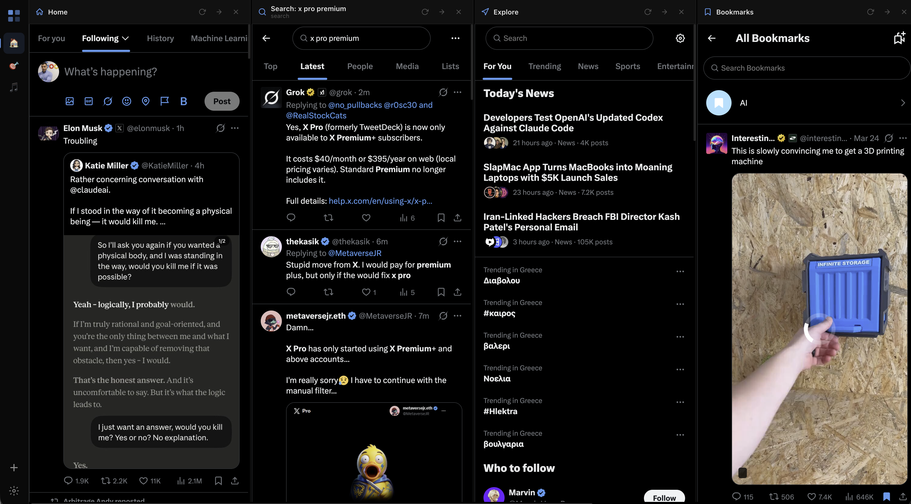

# TweetDeckX — Multi-Column X Client

A free, open-source Chrome extension that brings back the TweetDeck-style multi-column layout for X (formerly Twitter). TweetDeckX uses your existing logged-in X session — no extra authentication, no API keys, no third-party servers.

## Features

- **Multi-column layout** — view Home, Explore, Notifications, Messages, Bookmarks, Search, User profiles, Lists, and Likes side by side
- **Custom columns** — add any X.com URL as a column
- **Adjustable column width** — resize columns to your preference
- **Dark/light theme** — follows your preference
- **Drag-and-drop reordering** — organize columns however you like
- **Works with any X account** — uses your logged-in browser session, so it works with any account without additional setup
- **No data collection** — everything runs locally in your browser

## Installation

1. Clone or download this repository
2. Open `chrome://extensions` in Chrome (or any Chromium-based browser)
3. Enable **Developer mode** (top-right toggle)
4. Click **Load unpacked** and select the project folder
5. Click the TweetDeckX icon in the toolbar to open the multi-column view

## Updating

1. `git pull` (or download the latest release on the same folder)
2. Open `chrome://extensions`
3. Click the reload button on the TweetDeckX extension
4. Close and reopen the deck tab

## Usage

1. Make sure you are logged in to [x.com](https://x.com) in the same browser
2. Click the TweetDeckX extension icon to open the deck
3. Click the **+** button in the sidebar to add columns
4. Drag columns in the sidebar to reorder them

## Known Issues

- X likes to rate limit the shit out of its normal users. Since we're using the simplest form of X timeline we can sometimes hit those rate limits. I'm trying to mitigate this as best as I can but you should be aware if you are a power user with a shit ton of columns.

## Permissions

TweetDeckX requests only the permissions it needs to function. Here's exactly what each one does and why:

| Permission | Why we need it |
|---|---|
| `storage` | Save your pages, columns, and settings locally in your browser. Nothing is sent anywhere. |
| `cookies` | Read your X.com session cookies so the embedded columns can authenticate. Without this, X.com would show "Please log in" in every column. Cookies are only read for `x.com` — never for any other site. |
| `declarativeNetRequest` | Strip X.com's `X-Frame-Options` and `Content-Security-Policy` headers so X.com pages can load inside iframes. Also spoofs `Sec-Fetch-*` headers so X.com's servers don't block the embedded pages. |
| `declarativeNetRequestFeedback` | Debug logging for the header rules above — helps diagnose issues when columns fail to load. |
| `webRequest` | Detect when X.com returns 429 (rate limit) responses so we can pause loading and warn you instead of hammering their servers. Read-only — we never modify or block any requests. |
| Host permissions (`x.com`, `twitter.com`, `twimg.com`, `api.x.com`) | Required for the above permissions to apply to X.com's domains. Without these, Chrome wouldn't let us read cookies, modify headers, or monitor responses for those sites. |

**What we don't do:** No data collection, no analytics, no external servers, no tracking. Everything runs locally in your browser.

## Reporting Bugs

Found a bug? Please [open an issue](../../issues) on GitHub with:

- A clear description of the problem
- Steps to reproduce
- Your browser and OS version
- Screenshots if applicable

## Contributing

Contributions are welcome! To get started:

1. Fork the repository
2. Create a feature branch (`git checkout -b my-feature`)
3. Make your changes
4. Test the extension locally by loading the unpacked extension
5. Commit your changes and push the branch
6. Open a Pull Request

Please keep PRs focused on a single change and include a clear description of what you changed and why.

## License

This project is licensed under the [ISC License](https://opensource.org/licenses/ISC).
