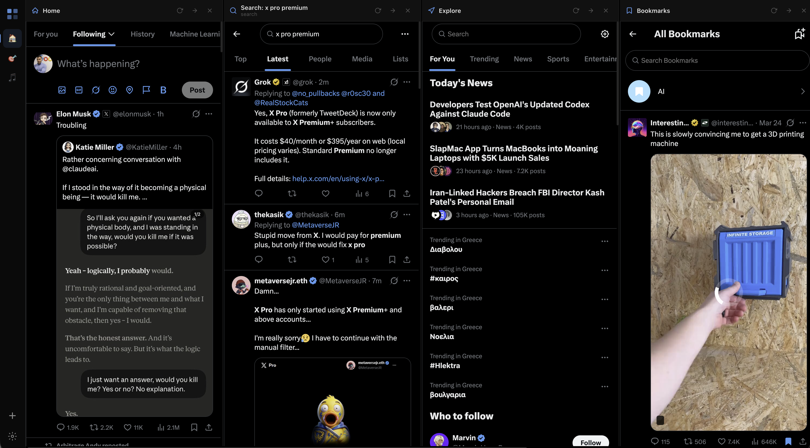

# TweetDeckX — Multi-Column X Client

> [!WARNING]
> **Use this at your own risk.** TweetDeckX operates in a gray area of X's Terms of Service. If this project gains traction, X may actively work against it. Your account could be shadowbanned or suspended. I'm doing my best to work around any blockades, but nothing is guaranteed.

A free, open-source Chrome extension that brings back the TweetDeck-style multi-column layout for X (formerly Twitter). TweetDeckX uses your existing logged-in X session — no extra authentication, no API keys, no third-party servers.

## Features

- **Multi-column layout** — view Home, Explore, Notifications, Messages, Bookmarks, Search, User profiles, Lists, and Likes side by side
- **Custom columns** — add any X.com URL as a column
- **Notifications panel**: the bell in the sidebar docks your notifications next to the sidebar on every page, so you can check them without switching pages. A badge on the bell shows your unread count
- **Compose from anywhere**: the blue pen button in the sidebar opens X's own composer over whichever page you're on
- **Adjustable column width** — resize columns to your preference
- **Dark/light theme** — follows your preference
- **Drag-and-drop reordering** — organize columns however you like
- **Works with any X account** — uses your logged-in browser session, so it works with any account without additional setup
- **No data collection** — everything runs locally in your browser

## Installation

1. Clone or download this repository
2. Open `chrome://extensions` in Chrome (or any Chromium-based browser)
3. Enable **Developer mode** (top-right toggle)
4. Click **Load unpacked** and select the project folder
5. Click the TweetDeckX icon in the toolbar to open the multi-column view

## Updating

1. `git pull` (or download the latest release on the same folder)
2. Open `chrome://extensions`
3. Click the reload button on the TweetDeckX extension
4. Close and reopen the deck tab

## Usage

1. Make sure you are logged in to [x.com](https://x.com) in the same browser
2. Click the TweetDeckX extension icon to open the deck
3. Click the **+** button in the sidebar to add columns
4. Drag columns in the sidebar to reorder them
5. Click the bell in the sidebar to show or hide the notifications panel. It stays open across pages and when you reopen the deck
6. Click the pen button in the sidebar to write a post. Once the post is sent, or you close X's composer, the composer goes away. Click outside it to hide it and keep your draft for later

## Keyboard Shortcuts

Keyboard shortcuts are off by default. Turn them on in **Settings**.

| Key | Action |
|---|---|
| `1`-`9`, `0` | Focus column 1-9, or column 10 |
| `Shift` + `1`-`9` | Switch to page 1-9 |
| `Shift` + `H` / `Shift` + `L` | Focus the previous / next column |
| `Backspace` | Go back in the focused column |
| `Shift` + `N` | Add a column |
| `Shift` + `P` | Add a page |

Once a column has focus, X's own shortcuts work inside it, such as `j` / `k` to move between posts, `Enter` to open a post, `l` to like, `r` to reply and `t` to repost. Press `?` inside a column for X's full list. Shortcuts are ignored while you are typing in a text field.

## Rate limits

X rate limits its own website per user and per endpoint, in 15 minute windows. Search is the tightest: roughly 50 timeline fetches per window, shared by every search column you have open. TweetDeckX works inside those limits instead of hoping for the best:

- **Only the column under your pointer is awake.** Every other column is made to look like a hidden browser tab, so X's own client stops its badge and message polling, suspends its live event stream and tells X the user is inactive. This uses X's own code paths rather than fighting them. Waking a column only flips it back to visible; no focus event is faked, because X refetches Home on every focus.
- **Refreshes happen in place.** A refresh calls X's own timeline component to load new posts, which is one request, instead of reloading the whole page, which is twenty or more. Changing a column's view (toggling replies, clearing a search) goes through X's router the same way a link click does. X's `.` shortcut is the fallback, and a page reload the last resort, each only when the step before it demonstrably fetched nothing.
- **Background refreshes follow X Pro's own policy.** Columns on screen refresh about every 5 minutes. Columns just off screen refresh half as often, columns further away a tenth as often, and columns on other pages not at all until you switch back, when any older than a refresh interval catch up one at a time.
- **The deck knows its budget.** Every X response carries `x-rate-limit-remaining` and `x-rate-limit-reset` headers. Each column reads them off its own responses, so the deck knows which endpoint a column actually spends on, shows the remaining calls on its header (for example `12/50`, hover for details), and will not load or refresh it when that endpoint has fewer than 3 calls left. Columns that have to wait say so and load themselves when the window resets.
- **A 429 pauses exactly as long as X says.** A toast names the endpoint and the reset time X sent, and the column header shows `0/50` until then. X's `backoff-policy` header is honoured across all columns too.
- **The notifications panel and the composer follow the same rules.** The panel loads only when you open it, is awake only while your pointer rests on it (resting on a column puts it back to sleep), refreshes in place in the background while open, and does nothing while closed. The composer loads the first time you use it and is reused after that, so composing again doesn't boot X again. It stays awake for 5 minutes after it closes, so a post still uploading media isn't paused mid-send.
- **The unread badge costs nothing.** It shows the count X's own badge poll returns in whichever column or panel is awake, so it catches up whenever you use the deck and keeps its last value while you're away.
- **Telemetry is stubbed.** X's client event, error log and app context beacons are answered locally so they never count against you.

## Known Issues

- Rate limits are per account, so other x.com tabs and apps using the same account share the same budget. The deck can see them but can't stop them.

## Permissions

TweetDeckX requests only the permissions it needs to function. Here's exactly what each one does and why:

| Permission | Why we need it |
|---|---|
| `storage` | Save your pages, columns, and settings locally in your browser. Nothing is sent anywhere. |
| `cookies` | Read your X.com session cookies so the embedded columns can authenticate. Without this, X.com would show "Please log in" in every column. Cookies are only read for `x.com` — never for any other site. |
| `declarativeNetRequest` | Strip X.com's `X-Frame-Options` and `Content-Security-Policy` headers so X.com pages can load inside iframes. Also spoofs `Sec-Fetch-*` headers so X.com's servers don't block the embedded pages. |
| `declarativeNetRequestFeedback` | Debug logging for the header rules above — helps diagnose issues when columns fail to load. |
| `webRequest` | Read the `x-rate-limit-*` and `backoff-policy` headers on X.com responses, and detect 429s, so the deck can budget column loads and pause for exactly as long as X asks. Read-only — we never modify or block any requests. |
| Host permissions (`x.com`, `twitter.com`, `twimg.com`, `api.x.com`) | Required for the above permissions to apply to X.com's domains. Without these, Chrome wouldn't let us read cookies, modify headers, or monitor responses for those sites. |

**What we don't do:** No data collection, no analytics, no external servers, no tracking. Everything runs locally in your browser.

## Reporting Bugs

Found a bug? Please [open an issue](../../issues) on GitHub with:

- A clear description of the problem
- Steps to reproduce
- Your browser and OS version
- Screenshots if applicable

## Contributing

Contributions are welcome! To get started:

1. Fork the repository
2. Create a feature branch (`git checkout -b my-feature`)
3. Make your changes
4. Test the extension locally by loading the unpacked extension
5. Commit your changes and push the branch
6. Open a Pull Request

Please keep PRs focused on a single change and include a clear description of what you changed and why.

## License

This project is licensed under the [ISC License](https://opensource.org/licenses/ISC).
